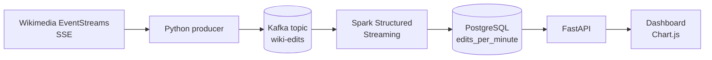

# WikiPulse

A real-time data pipeline that ingests the live Wikimedia edit stream, aggregates it with Spark Structured Streaming, stores the results in PostgreSQL, and serves them through a FastAPI backend to a live dashboard. Everything runs with one `docker compose up`.


## What it answers

- **Activity over time:** how many edits per minute, and how that changes through the day
- **Most active wikis right now:** which language editions and sister projects are busiest
- **Bots vs humans:** what share of edits comes from automated accounts

Wikidata produces far more edits than any other wiki and would drown out everything else, so the dashboard has an **Include Wikidata** toggle (off by default).

## Architecture



1. The **producer** keeps a connection open to the Wikimedia stream and publishes each raw event to Kafka, keyed by wiki. It reconnects automatically with backoff.
2. **Kafka** buffers the events and decouples ingestion from processing.
3. **Spark** keeps only real edits, groups them into 1-minute windows per wiki and bot flag, and upserts the results into Postgres.
4. **FastAPI** exposes three endpoints that query the aggregates, and also serves the dashboard page.
5. The **dashboard** polls the API every 5 seconds and updates three charts.

## Tech stack and why

| Tool | Why it's here |
|---|---|
| Kafka (KRaft) | Durable buffer between ingestion and processing; lets Spark replay history after a restart |
| Spark Structured Streaming | Windowed aggregations with event-time semantics and watermarking |
| PostgreSQL | Simple, queryable store for the aggregates; supports upserts and window functions |
| FastAPI | Small typed API layer with automatic docs at `/docs` |
| Chart.js | Lightweight charts with no build step |
| Docker Compose | Reproducible local environment, one command to start |

## Run it

Requires Docker Desktop.

```bash
git clone https://github.com/YOUR-USERNAME/YOUR-REPO.git
cd YOUR-REPO
cp .env.example .env        # then edit .env: set WIKI_CONTACT and a password
docker compose up -d --build
```

- Dashboard: http://localhost:8000
- API docs: http://localhost:8000/docs

The first start takes a few minutes (image downloads, plus Spark fetching the Kafka connector). Charts fill in after a minute or two of data. Stop with `docker compose down` (data is kept; add `-v` to wipe it).

## Project structure

```
.
├── docker-compose.yml
├── .env.example            # copy to .env (not committed)
├── producer/               # Wikimedia stream -> Kafka
├── spark/                  # Kafka -> windowed aggregates -> Postgres
├── api/                    # FastAPI endpoints + static dashboard
└── sql/queries.sql         # the analytical queries behind the charts
```

## Design decisions

- **Raw events go into Kafka untouched.** Parsing and filtering happen in Spark, so the cleaning logic can change and the history can be replayed.
- **Event time, not processing time.** Windows use the edit's own timestamp. A 2-minute watermark bounds how long Spark waits for late events.
- **Idempotent writes.** Spark runs in `update` mode, so each output row is the latest total for its window. The table's primary key is `(window_start, wiki, is_bot)` and writes are upserts, so reprocessing a window overwrites it instead of double counting.
- **Keyed messages.** Events are keyed by wiki, so each wiki's events stay in order within one partition.
- **Filtering.** Only `type = 'edit'` events are counted; category changes and log events are dropped.
- **Secrets in `.env`.** Credentials and the Wikimedia contact string are read from environment variables; only `.env.example` is committed.

## Problems I ran into

- **Kafka lost its data on `docker compose down`.** The image stores logs in a different directory than the one I had mounted as a volume. Setting `KAFKA_LOG_DIRS` to the mounted path fixed it.
- **Spark failed with an offset mismatch.** Its checkpoint remembered offsets that no longer existed in Kafka. Resetting the checkpoint volume fixed it, and it showed me how checkpoints and Kafka storage depend on each other.

## Limitations and what I'd change at scale

- Single Kafka broker with replication factor 1; production would use several brokers and higher replication.
- Spark runs in local mode inside one container; at scale it would run on a cluster.
- No schema registry or schema evolution handling for the events.
- No automated tests, monitoring, or alerting yet.
- The dashboard polls the API; server-sent events or websockets would push updates instead.
- Aggregates are kept forever; a real deployment would add retention or rollup tables.

## Data source

[Wikimedia EventStreams](https://stream.wikimedia.org/?doc), a public stream of changes across all Wikimedia projects. No API key needed.
